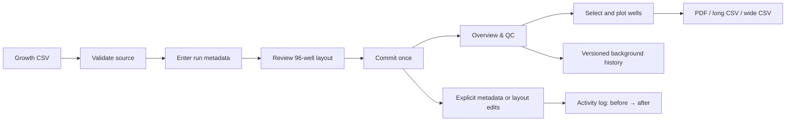

# Growth workflow user guide

This guide follows the current Growth interface. MIC menus are intentionally out
of scope.

## Create a Growth run

1. Open **New Growth Run** and choose a plate-reader CSV. The synthetic 24-hour
   demo is safe for learning.
2. Validate the source. Confirm well count, timepoints, interval, duration, and
   warnings before continuing.
3. Enter the complete experiment and plate metadata. These values become
   searchable and remain editable later.
4. Review the layout in either **96-well plate** or **Full well table**. Both edit
   the same staged layout. Set display names, conditions, blanks, background
   groups, and plot defaults. Nothing is saved yet.
5. Review and commit. The database write is atomic; raw readings are immutable.

## Inspect and correct background

Open the run from **Growth Run Library**, then use **Overview & QC**. The heatmap
checks a channel and timepoint across the physical plate. A background
calculation uses Blank wells to estimate a baseline for each timepoint, channel,
and background group.

**Background history** is a calculation receipt:

- **Current · ready**: calculation matches the saved blank/group layout.
- **Current · stale**: blank or group assignments changed afterward. Recompute
  before relying on corrected curves.
- **Previous calculation**: retained for traceability, not currently used.

Raw measurements are never overwritten. A revision stores the method, inputs,
derived values, author, and time.

## Select and plot curves

Use the plate, selection list, or metadata filters in **Plotting**; all three
control one selection. Rendering does not save it. Press **Save well selection**
only when it should become the default for later sessions.

Set **Curve label format** to **Single field** to use Display name, strain,
group, treatment, or an available custom field. Select **Combine fields** to
build each label from several fields, in the order selected, just like the
display-name builder. You can set the separator, prefix, suffix, and whether
empty values are omitted. Unique labels appear without physical well IDs. If
two wells share a final label, the legend adds `(A1)`, `(A2)`, and so on to
prevent ambiguous traces and export columns. Choose curve colors independently.

Use **Dark mode** in the sidebar when desired. It is a browser-session preference
and does not modify data. It applies to selectors, number inputs, buttons,
reference tables, 96-well grids, and selection lists.

## Choose the correct export

- **Download plot as PDF**: vector copy of the visible curves.
- **Download database data (long CSV)**: one row per well/channel/timepoint with
  physical well, display name, metadata, raw/plotted values, correction state,
  and revision identity. Use for database exchange, auditing, or reproducibility.
- **Download plot data (wide CSV)**: first column is `Time (minutes)`; every other
  column is one visible curve named like the legend. Use for Prism, Excel, R,
  Python, or recreating the displayed plot.

Both CSVs contain the selected prepared data. The long export preserves physical
identity; the wide export prioritizes readable curve names.

## Edit safely and read Activity log

Metadata and layout changes are staged until an explicit Save. Activity log then
records user, time, and exact before/after stored values. Large edits show the
first changes in the table and retain the complete payload under **Technical
activity details**.

In an existing workspace, **Apply and save generated names** and **Apply and save
uploaded names** are explicit exceptions: they immediately save only the changed
Display names. Other staged layout fields still require **Save full layout**.

Opening a run, changing an unsaved control, and rendering a plot are not logged;
they do not change stored data. Raw reading edits are not provided. If a source
is wrong, preserve the run for traceability and import the corrected source as a
new run.

## Recommended routine

1. Commit only after source, metadata, and layout review.
2. Inspect raw heatmaps before background correction.
3. Save blank/group assignments and compute the background revision.
4. Render corrected curves with meaningful Display names.
5. Export long CSV for the record and wide CSV for downstream plotting.
6. Check Activity log after any saved metadata or layout correction.
