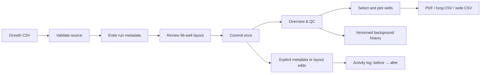

# Growth workflow user guide

This guide follows the current Growth interface. MIC menus are intentionally out
of scope.

## Create a Growth run

1. Open **New Growth Run** and choose a plate-reader CSV. The synthetic 24-hour
   demo is safe for learning.
2. Validate the source. Confirm well count, timepoints, interval, duration, and
   warnings before continuing.
3. Enter the complete experiment and plate metadata. These values become
   searchable and remain editable later.
4. Review the layout in either **96-well plate** or **Full well table**. Both edit
   the same staged layout. Set display names, conditions, blanks, background
   groups, and plot defaults. Nothing is saved yet.
5. Review and commit. The database write is atomic; raw readings are immutable.

## Browse the Run Library

Readiness columns show background subtraction status and calculation time, background
QC flags, saved cultivation IDs, missing strain names and the assigned experiment
number. This lets you choose experiments to revisit without opening their datasets.

- **Current**: the background calculation matches the current blank/group layout.
- **Needs recalculation**: blanks or background groups changed after calculation.
- **Calculated (verify)**: older results exist, but their freshness cannot be checked
  from metadata alone. Open the workspace to verify, or recalculate there.
- **Not calculated / No current revision / No results**: background subtraction is
  unavailable; open the workspace to compute it.

QC flags count background result records, not wells. Cultivation counts exclude blank
controls; missing-strain wells are included as incomplete. Saved ID counts describe
what is stored; the export still validates its IDs against the current conditions.
Press **Search** to refresh these statuses after making changes.

The Run Library includes each universal Growth custom-layout column. Since a run
can assign different values to different wells, its Library cell shows the
distinct values as a comma-separated summary; an em dash means that run has no
saved value. These summaries are metadata-only and do not load growth curves.

## Inspect and correct background

Open the run from **Growth Run Library**, then use **Overview & QC**. The heatmap
checks a channel and timepoint across the physical plate. A background
calculation uses Blank wells to estimate a baseline for each timepoint, channel,
and background group.

**Background history** is a calculation receipt:

- **Current · ready**: calculation matches the saved blank/group layout.
- **Current · stale**: blank or group assignments changed afterward. Recompute
  before relying on corrected curves.
- **Previous calculation**: retained for traceability, not currently used.

Raw measurements are never overwritten. A revision stores the method, inputs,
derived values, author, and time.

## Select and plot curves

Use the plate, selection list, or metadata filters in **Plotting**; all three
control one browser-session selection. Checks in the 96-well grid are staged
without rerunning the page; you can drag across cells to change several wells at
once. **Render selected curves** uses the checked wells directly. Plot selection
is not written to the run or used as a later default.

Set **Curve label format** to **Single field** to use Display name, strain,
group, treatment, or an available custom field. Select **Combine fields** to
build each label from several fields, in the order selected, just like the
display-name builder. You can set the separator, prefix, suffix, and whether
empty values are omitted. Unique labels appear without physical well IDs. If
two wells share a final label, the legend adds `(A1)`, `(A2)`, and so on to
prevent ambiguous traces and export columns. Choose curve colors independently.

Use **Dark mode** in the sidebar when desired. It is a browser-session preference
and does not modify data. It applies to selectors, number inputs, buttons,
reference tables, 96-well grids, and selection lists.

## Choose the correct export

- **Download plot as PDF**: vector copy of the visible curves.
- **Download database data (long CSV)**: one row per well/channel/timepoint with
  physical well, display name, metadata, raw/plotted values, correction state,
  and revision identity. Use for database exchange, auditing, or reproducibility.
- **Download plot data (wide CSV)**: first column is `Time (minutes)`; every other
  column is one visible curve named like the legend. Use for Prism, Excel, R,
  Python, or recreating the displayed plot.

Both CSVs contain the selected prepared data. The long export preserves physical
identity; the wide export prioritizes readable curve names.

For complete data from several runs, open **Growth Data Export** in the sidebar.
Search the Library metadata, select one or more Growth runs, and press **Prepare
selected runs**. Its selection table shows the same strain, media, treatment,
concentration, inoculum, and universal custom-column summaries as the Run Library.
Searching and checking rows do not load measurements. Preparation creates two files:

- `growth_runs.csv`: every OD observation with separate **Raw OD**, **Background
  Mean OD**, and **Background Subtracted OD** columns, plus background SD, blank
  count, group, and QC status. **Cultivation ID** links each observation to its
  metadata row. Every canonical Growth layout field and universal custom column
  is retained, with separate treatment/concentration/unit fields for combinations;
- `growth_runs_metadata.csv`: one row per well/cultivation, with **Cultivation**
  matching the data file ID. It includes the experiment context, objective, protocols,
  inoculation time, strain, medium, biological replicate, well location and custom metadata.

When exactly one run is selected, both download names use the normalized experiment
name plus its stable eight-character run hash, for example
`my_growth_experiment_dbea359c.csv` and
`my_growth_experiment_dbea359c_metadata.csv`. Multi-run exports use the generic
names shown above.

Custom columns added under **Manage custom columns** are shared by every Growth
experiment. Their values remain specific to each well and experiment, so they are
appended to `growth_runs.csv`, including universally registered columns whose
values are blank in the selected runs. They are also retained in the companion
metadata file, together with full well, plate and experiment custom JSON.

To add shared cultivation information to several experiments, select their entries
in **Growth Run Library** and press **Edit cultivation metadata**. The editor shows
the current values for the selected runs. Choose the fields to update, enter their
shared values, and press **Save cultivation metadata to selected runs**. This works
for team/system defaults, objective, equipment, protocols, program metric, cultivation
experiment ID, inoculation date/time and comment.

**Fill empty values only** is enabled initially. Uncheck it to replace the chosen
fields across the selection; an empty value then clears that field. Fields you did
not select and per-well metadata remain intact. Team/system changes set defaults for
future ID generation; saved cultivation IDs retain their components. Per-well
registry overrides still take precedence in exports. The batch commits together;
if another session changes a run, reopen the editor to load the new values before
retrying. Search or Cancel closes the batch without saving. Editors and admins can
use this action. These shared values are saved on the selected runs and are available
in each workspace and cultivation export.

Use **Growth Data Export → Saved experiment + condition IDs (recommended)** for the
persistent cultivation registry. Select one or multiple experiments, enter the team and
cultivation system codes (or leave them blank to use saved metadata), and press
**Preview cultivation IDs**. Preview reads metadata only. Review the per-well IDs
and cultivation-experiment ranges, then press **Save IDs and prepare export** to save
and build both CSV files. **Save cultivation IDs** also remains available separately;
**Prepare selected runs** exports existing saved assignments. Preview alone does not
save IDs. The default workflow blocks export when assignments have not been saved,
instead of producing empty cultivation columns. Editors and admins can save; viewers
can export existing saved assignments. Saving is atomic across selected experiments
and preserves raw measurements and other metadata.

The required-style ID is `ST-EXP-MG1655-MP96A0101R1`:

| Part | Meaning |
| --- | --- |
| `ST` | Team |
| `MG1655` | Well strain |
| `MP96A` | Cultivation system |
| `01` (first part of `0101`) | Experiment number |
| `01` (last part of `0101`) | Condition group within that experiment |
| `R1` | Replicate well within the condition group; a technical replicate in this workflow |

Matching wells on experiment 01 share `0101` and receive `R1`, `R2`, etc. A different
condition uses `0102R1`. Experiment 02 starts with `0201R1`; condition numbers never span
experiments. Experiment numbers start at 01 in chronological library order and remain fixed
once saved. Condition groups follow physical well order and remain fixed once saved.
Numbers use at least two digits per part; experiment 100 becomes `10001`, without changing
old IDs. `CultivationRun` stores the combined code, with the separate experiment and
condition numbers also retained. `CultivationExperiment` contains the corresponding
range, such as `ST-EXP-MG1655-MP96A[0101-0103]`. Multiple strains receive separate
ranges, listing gaps explicitly where necessary.

Two identities are available in both files: the stable **Internal cultivation ID**
(the database well ID), and the external **Cultivation ID** above. A readable local
label such as `EXP01-A01` is also saved. All wells receive internal/local IDs; blanks
and wells without a strain do not receive fabricated external IDs. Missing strain
is flagged for completion. **Biological replicate group** identifies the experiment's
condition group (`0101`); **Technical replicate** is the within-group R number. The
registry's required **Replicate** column carries that same R value. Original Layout
labels remain separately available as **Local replicate** / **LocalReplicate**.

Each experiment is one physical plate and owns its unique, persistent number.
The first part of the code is exported as `CultivationExperimentNumber`.

In the strain part of a cultivation ID, spaces and hyphens become underscores,
and `Δ` or `δ` becomes `d`: `ΔacrB MG 1-2` becomes `dacrB_MG_1_2`. Preview shows
these substitutions once in an informational section. Original strain names remain
unchanged in layout and exported metadata. Missing-strain warnings identify specific
wells; their measurements and internal IDs remain in the files. Blank controls do
not produce missing-cultivation-ID warnings.

Matching uses strain, medium, treatment doses and units (including combinations),
inoculum, temperature, culture volume and chosen additional condition fields.
**Concentration matching** defaults to **2 significant figures**: `0.1875` and `0.19`
match as `0.19`. Exact, 3 and 4 figure options are available before first assignment.
Micro-unit spellings (`µ`, `μ`, `u`, and known encoding artifacts such as `Œº`) match
as ASCII `u`; unit scales are not converted. Original concentration columns stay
unchanged, with **Matching concentration** columns and the precision rule alongside.

Press **Prepare selected runs** to download data using the IDs already saved on each
well. Changing the selected plates does not regenerate IDs. Saved matching rules
are used for later exports. Changed identity-defining conditions are reported rather
than silently changing an assigned ID. Correct the metadata discrepancy before
exporting; ordinary local replicate-label edits do not change the cultivation ID.
Replaced older-format IDs remain in **PreviousCultivationIDs** and provenance.

The **Legacy export patterns** option retains older export-only naming controls.
Persistent plate/condition IDs remain authoritative even there. The workspace's legacy
ID generator cannot overwrite a plate that has persistent plate/condition IDs.
Shared scientific descriptions can still be edited through the Growth Run Library.

Shared descriptions apply to this plate; per-well custom columns named
`InoculationDateTime`, `Local_Cultivation_ID`, `Strain/Strain_Aliases`, `Objective`,
or the other registry fields override their descriptive defaults. Dates accept
`YYYY-MM-DD HH:MM` (optionally with seconds/time zone). Culture age uses measurement
time minus inoculation time when both timestamps exist, otherwise the existing
elapsed-time plus culture-age-offset convention. Unknown fields and unassigned
cultivation IDs stay blank, with an export warning. Duplicate IDs across the selected
runs and IDs that no longer match their saved identity or condition metadata prevent
export until corrected. Exports keep both the cultivation replicate and local label.

If a background revision is missing or stale, raw OD is still exported while the
background and corrected cells remain blank and the QC reason identifies the
problem. Recompute the background revision before preparing the files when
complete corrected data is required.

## Edit safely and read Activity log

Metadata and layout changes are staged until an explicit Save. Activity log then
records user, time, and exact before/after stored values. Large edits show the
first changes in the table and retain the complete payload under **Technical
activity details**.

In an existing workspace, **Apply and save generated names** and **Apply and save
uploaded names** are explicit exceptions: they immediately save only the changed
Display names. Other staged layout fields still require **Save full layout**.

Opening a run, changing an unsaved control, and rendering a plot are not logged;
they do not change stored data. Raw reading edits are not provided. If a source
is wrong, preserve the run for traceability and import the corrected source as a
new run.

## Recommended routine

1. Commit only after source, metadata, and layout review.
2. Inspect raw heatmaps before background correction.
3. Save blank/group assignments and compute the background revision.
4. Render corrected curves with meaningful Display names.
5. Export long CSV for the record and wide CSV for downstream plotting, or use
   Growth Data Export when combining complete runs.
6. Check Activity log after any saved metadata or layout correction.

The measurement CSV retains **Experiment Date** even when a source start clock time
is unavailable. **Date Time** then stays blank; elapsed **Time Min** and culture-age
values remain available. An experiment date or inoculation time is not assumed to be
the reader start time. If corrected OD is missing because there is no current
background revision, compute the background in the run workspace and prepare the
export again. Raw OD is retained. Descriptive fields such as objective and protocol
remain blank until supplied through the cultivation metadata editor.
