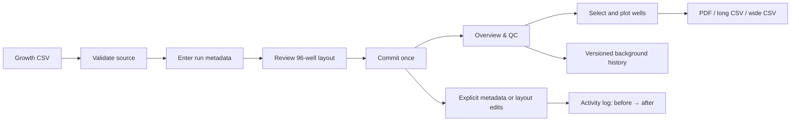

# Growth workflow user guide

This guide follows the current Growth interface. MIC menus are intentionally out
of scope.

## Create a Growth run

1. Open **New Growth Run** and choose a plate-reader CSV. The synthetic 24-hour
   demo is safe for learning.
2. Validate the source. Confirm well count, timepoints, interval, duration, and
   warnings before continuing.
3. Enter the complete experiment and plate metadata. These values become
   searchable and remain editable later.
4. Review the layout in either **96-well plate** or **Full well table**. Both edit
   the same staged layout. Set display names, conditions, blanks, background
   groups, and plot defaults. Nothing is saved yet.
5. Review and commit. The database write is atomic; raw readings are immutable.

## Browse the Run Library

The Run Library includes each universal Growth custom-layout column. Since a run
can assign different values to different wells, its Library cell shows the
distinct values as a comma-separated summary; an em dash means that run has no
saved value. These summaries are metadata-only and do not load growth curves.

## Inspect and correct background

Open the run from **Growth Run Library**, then use **Overview & QC**. The heatmap
checks a channel and timepoint across the physical plate. A background
calculation uses Blank wells to estimate a baseline for each timepoint, channel,
and background group.

**Background history** is a calculation receipt:

- **Current · ready**: calculation matches the saved blank/group layout.
- **Current · stale**: blank or group assignments changed afterward. Recompute
  before relying on corrected curves.
- **Previous calculation**: retained for traceability, not currently used.

Raw measurements are never overwritten. A revision stores the method, inputs,
derived values, author, and time.

## Select and plot curves

Use the plate, selection list, or metadata filters in **Plotting**; all three
control one browser-session selection. Checks in the 96-well grid are staged
without rerunning the page; you can drag across cells to change several wells at
once. **Render selected curves** uses the checked wells directly. Plot selection
is not written to the run or used as a later default.

Set **Curve label format** to **Single field** to use Display name, strain,
group, treatment, or an available custom field. Select **Combine fields** to
build each label from several fields, in the order selected, just like the
display-name builder. You can set the separator, prefix, suffix, and whether
empty values are omitted. Unique labels appear without physical well IDs. If
two wells share a final label, the legend adds `(A1)`, `(A2)`, and so on to
prevent ambiguous traces and export columns. Choose curve colors independently.

Use **Dark mode** in the sidebar when desired. It is a browser-session preference
and does not modify data. It applies to selectors, number inputs, buttons,
reference tables, 96-well grids, and selection lists.

## Choose the correct export

- **Download plot as PDF**: vector copy of the visible curves.
- **Download database data (long CSV)**: one row per well/channel/timepoint with
  physical well, display name, metadata, raw/plotted values, correction state,
  and revision identity. Use for database exchange, auditing, or reproducibility.
- **Download plot data (wide CSV)**: first column is `Time (minutes)`; every other
  column is one visible curve named like the legend. Use for Prism, Excel, R,
  Python, or recreating the displayed plot.

Both CSVs contain the selected prepared data. The long export preserves physical
identity; the wide export prioritizes readable curve names.

For complete data from several runs, open **Growth Data Export** in the sidebar.
Search the Library metadata, select one or more Growth runs, and press **Prepare
selected runs**. Its selection table shows the same strain, media, treatment,
concentration, inoculum, and universal custom-column summaries as the Run Library.
Searching and checking rows do not load measurements. Preparation creates two files:

- `growth_runs.csv`: every OD observation with separate **Raw OD**, **Background
  Mean OD**, and **Background Subtracted OD** columns, plus background SD, blank
  count, group, and QC status. **Cultivation ID** links each observation to its
  metadata row. Every canonical Growth layout field and universal custom column
  is retained, with separate treatment/concentration/unit fields for combinations;
- `growth_runs_metadata.csv`: one row per well/cultivation, with **Cultivation**
  matching the data file ID. It includes the experiment context, objective, protocols,
  inoculation time, strain, medium, biological replicate, well location and custom metadata.

When exactly one run is selected, both download names use the normalized experiment
name plus its stable eight-character run hash, for example
`my_growth_experiment_dbea359c.csv` and
`my_growth_experiment_dbea359c_metadata.csv`. Multi-run exports use the generic
names shown above.

Custom columns added under **Manage custom columns** are shared by every Growth
experiment. Their values remain specific to each well and experiment, so they are
appended to `growth_runs.csv`, including universally registered columns whose
values are blank in the selected runs. They are also retained in the companion
metadata file, together with full well, plate and experiment custom JSON.

To add shared cultivation information to several experiments, select their entries
in **Growth Run Library** and press **Edit cultivation metadata**. The editor shows
the current values for the selected runs. Choose the fields to update, enter their
shared values, and press **Save cultivation metadata to selected runs**. This works
for team/system defaults, objective, equipment, protocols, program metric, cultivation
experiment ID, inoculation date/time and comment.

**Fill empty values only** is enabled initially. Uncheck it to replace the chosen
fields across the selection; an empty value then clears that field. Fields you did
not select and per-well metadata remain intact. Team/system changes set defaults for
future ID generation; saved cultivation IDs retain their components. Per-well
registry overrides still take precedence in exports. The batch commits together;
if another session changes a run, reopen the editor to load the new values before
retrying. Search or Cancel closes the batch without saving. Editors and admins can
use this action. These shared values are saved on the selected runs and are available
in each workspace and cultivation export.

In a saved run, open **Metadata → Cultivation metadata and ID pattern**. Choose the
recommended **Experiment number + well** pattern and enter your team code. The
experiment number is suggested in chronological order across unnumbered Growth runs:
oldest experiment `001`, next `002`, and so on, even before any IDs are saved.
Experiment date sets the order; ties use creation time and run ID. Missing or invalid
dates come last. Already saved numbers are kept and skipped when suggesting numbers
for other runs. You can edit the suggestion. Preview does not consume a number.
Once saved, the number remains with the run. Dates remain in metadata.

Generate IDs directly in **Growth Data Export**: select the runs, open the
**Cultivation ID generation** controls, choose a pattern and enter a team code
(or leave it blank to use saved team codes). The recommended pattern includes the
experiment number, well position and required `R` suffix. Missing experiment
numbers are suggested across the Growth library in chronological order, beginning
at `001`; saved numbers remain fixed. No workspace ID-generation step is required.
Press **Generate cultivation IDs and prepare export** to see each well's ID,
experiment number, local label, export replicate and matching counts before download.

Matching wells across the selected plates receive cumulative `R1`, `R2`, and so on.
Each distinct condition group starts at R1. Selecting a different subset recalculates
the R numbers; it never changes saved IDs, labels or raw measurements. **Replicate**
in both CSVs is the cultivation replicate used in the ID. The observation file's
**Local replicate** and metadata's **LocalReplicate** retain your original Layout label.

Matching uses strain, medium, treatment doses and units (including combinations),
inoculum, temperature and culture volume. The unit spellings `u`, `µ`, and `μ` are
equivalent; known encoding artifacts such as `μg/mL` are repaired to `ug/mL`.
Concentration unit columns and composite condition text use `u` in both files.
No concentration values or scales are converted: `mg/mL` remains distinct from
`ug/mL`. Original metadata JSON is retained. Wells with missing strain or medium
are treated individually. Additional well custom condition fields can be specified
on the export page; saved matching fields are also included. A shared **Replicate
study/group** limits which selected plates count together; blank groups match other
blank groups. Apply those shared settings through **Growth Run Library → Edit
cultivation metadata**. Each matching well counts as one cultivation; choose study
groups appropriate to your experimental replication design.

**Concentration matching** defaults to **2 significant figures** in Growth Data
Export. This groups rounding differences such as `0.1875` and `0.19` as `0.19`,
or `0.09375` and `0.094` as `0.094`. It applies to all three treatment dose columns
before matching combinations; all other condition fields must still match. The
preview shows entered and matching concentrations. Choose **Exact values** to keep
these doses separate, or select 3 or 4 significant figures for finer matching.
Changing precision requires generating the export again.

Original **Concentration** columns and stored metadata remain unchanged. Both CSVs
add **Matching concentration**, **Matching concentration 2**, **Matching concentration
3**, and **Concentration matching significant figures** (`2`, `3`, `4`, or `exact`).
Use the matching columns when grouping exported data with the same rule as cultivation
replicates. Significant figures preserve small nonzero doses instead of rounding all
small values to a fixed number of decimal places. This groups rounded input values;
it does not infer a dilution series or correct arbitrary entry errors.

Both CSVs link through the exported Cultivation ID and retain the original saved
ID (`SavedCultivation` / `Saved cultivation ID`). Disable generation to use saved
IDs. Workspace controls and previously saved condition-numbering settings remain
available. Missing required ID components are reported with blank IDs while OD and
metadata rows remain available. Shared scientific descriptions continue to come
from the saved metadata.

The export generator also supports the original laboratory pattern, e.g.
`PN-EXP-11_J3-BRV002R1`, with a system code and a saved cultivation run number
(or the chronological number when absent). **Custom pattern** supports `{team}`,
`{strain}`, `{system}`, `{run}`, `{experiment}`, `{well}`, and `{replicate}` and
must include `R{replicate}`. Choose saved patterns to retain each well's naming
format while assigning selected-run replicates. Pattern, team and system controls
affect only this export. Changing settings or selection hides old downloads until
you generate again. Numbering is local to the current database; exporting does not
reserve numbers. To persist a number, use the workspace metadata controls.

Shared descriptions apply to this plate; per-well custom columns named
`InoculationDateTime`, `Local_Cultivation_ID`, `Strain/Strain_Aliases`, `Objective`,
or the other registry fields override their descriptive defaults. Dates accept
`YYYY-MM-DD HH:MM` (optionally with seconds/time zone). Culture age uses measurement
time minus inoculation time when both timestamps exist, otherwise the existing
elapsed-time plus culture-age-offset convention. Unknown fields and unassigned
cultivation IDs stay blank, with an export warning. Duplicate IDs across the selected
runs and IDs that no longer match their saved identity or condition metadata prevent
export until corrected. Exports keep both the cultivation replicate and local label.

If a background revision is missing or stale, raw OD is still exported while the
background and corrected cells remain blank and the QC reason identifies the
problem. Recompute the background revision before preparing the files when
complete corrected data is required.

## Edit safely and read Activity log

Metadata and layout changes are staged until an explicit Save. Activity log then
records user, time, and exact before/after stored values. Large edits show the
first changes in the table and retain the complete payload under **Technical
activity details**.

In an existing workspace, **Apply and save generated names** and **Apply and save
uploaded names** are explicit exceptions: they immediately save only the changed
Display names. Other staged layout fields still require **Save full layout**.

Opening a run, changing an unsaved control, and rendering a plot are not logged;
they do not change stored data. Raw reading edits are not provided. If a source
is wrong, preserve the run for traceability and import the corrected source as a
new run.

## Recommended routine

1. Commit only after source, metadata, and layout review.
2. Inspect raw heatmaps before background correction.
3. Save blank/group assignments and compute the background revision.
4. Render corrected curves with meaningful Display names.
5. Export long CSV for the record and wide CSV for downstream plotting, or use
   Growth Data Export when combining complete runs.
6. Check Activity log after any saved metadata or layout correction.
