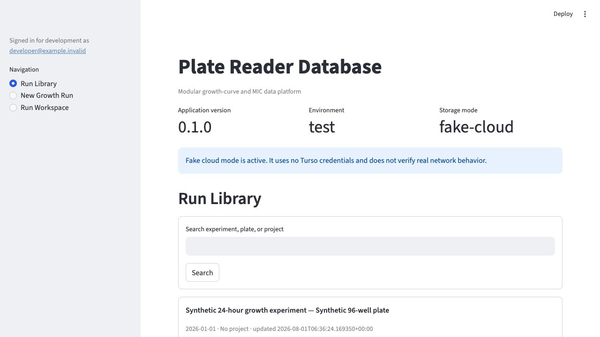
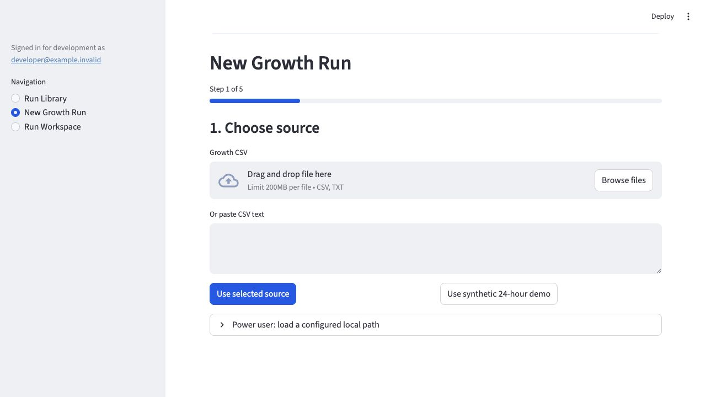
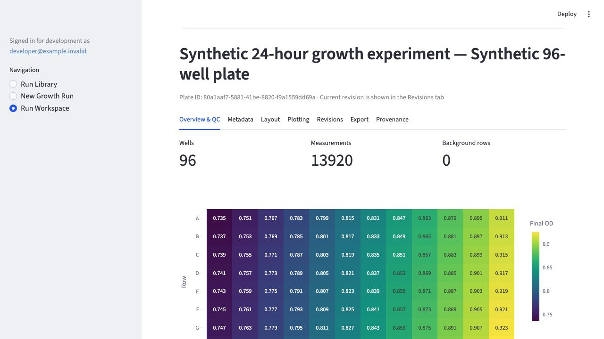
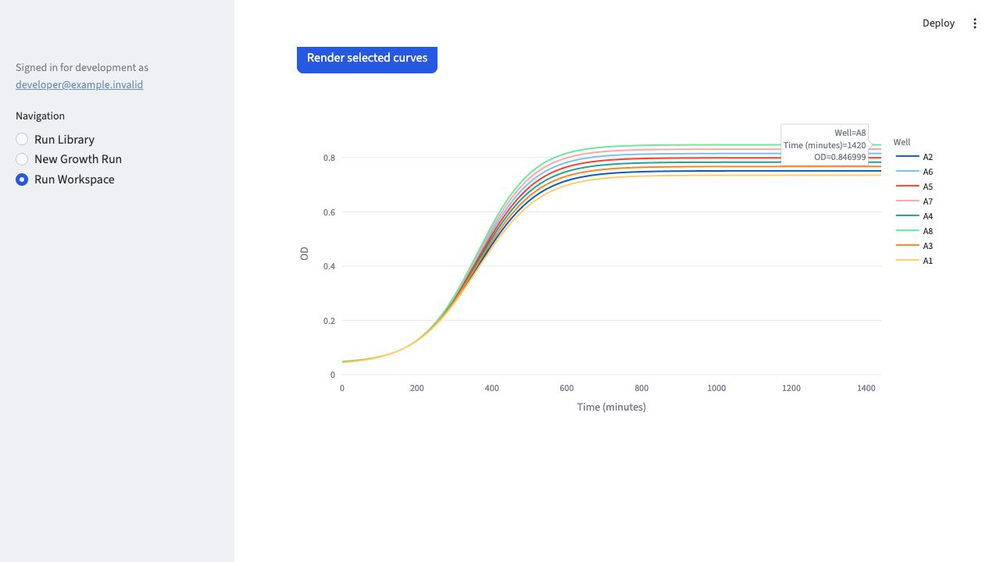

# Phase 4 growth workflow comparison

Status: locally verified on 2026-08-01 with the fake-cloud adapter.

## Comparison basis

The legacy growth v4 source was inspected read-only. Its deterministic parsing
and background outputs were captured in Phase 1 before new implementation work.
The new workflow was then exercised through Streamlit in a browser with a full
96-well, 145-timepoint synthetic run. No legacy database or laboratory file was
opened or changed during this verification.

| Workflow | Growth v4 | New local workflow | Result |
| --- | --- | --- | --- |
| Source selection | Upload or local folder discovery | Upload, paste, deterministic demo, or explicit local file path | Compatible; folder identity is no longer required |
| Validation | Several warnings occur after loading | Dedicated preview step blocks malformed time, wells, labels, and values before commit | Intentionally stricter |
| Save | Full-run autosave can rewrite raw rows | One explicit atomic commit; later metadata/layout writes cannot update raw tables | Safer intentional change |
| Library | Scans standalone database paths | Indexed repository search with portable SQLite exchange | Compatible purpose, different storage model |
| Overview | Large static multi-axis view | Fast final-OD 8x12 heatmap and visible raw/revision/QC state | Faster interactive replacement |
| Curves | Eager Matplotlib overview and selected curves | Plotly/WebGL curves rendered only on request and cached by raw hash/revision | Compatible core plotting |
| Background | Mean/SD/CV by time, channel, and blank group | Frozen `growth-background/1.0.0` calculation stored as an immutable revision | Scientifically compatible |
| Missing background | Silently treated as zero in some paths | Remains raw and visibly warns; it is never labeled corrected | Intentional correctness change |
| Export | Per-run SQLite and historical folder variants | Manifested, checksummed, standard-SQLite portable run | Compatible and independently verifiable |

Known Phase 4 differences retained for later work:

- the workspace edits one well explicitly rather than presenting an Arrow-backed
  96-row grid; the grid path was removed after it produced a native `pyarrow`
  crash during Streamlit testing;
- reusable layout templates and bulk condition paste belong to the MIC/shared UI
  phase;
- publication-specific static PDF styling remains an explicit later export
  feature; Plotly's built-in PNG action is available now.

## Visual record

### Run Library

SHA-256: `80ea254f7c8cb3b4f67075b52a72d0b74e92a8d961171367c2125efb0c1c28c4`

### Five-step import wizard

SHA-256: `7d545d347a2e74e044520b05ffceefdd542f2c2e71839523b73a250a9cc5a161`

### Run overview and plate heatmap

SHA-256: `2a1a9cc0701e6996cf4b013a1d213d219d5cd87c0a7326eafba9b0a3c6b04a17`

### Lazy selected-well curves

SHA-256: `3a1fc8875f43ddddf63a8bbb278eb1b5d938784d1c0ca704a90d8896880dd983`

## Output identity

The standard growth fixture SHA-256 is
`4e5fa46dea7554fa492778a6f36446ee1c7261ca7929ddd41579139420df7c23`.
The frozen normalized result SHA-256 is
`8f01b593a583e67358ece48d68f05e35748cfe15d5f45bfe0201f7eaf03900a2`.
Golden tests call the unmodified legacy implementation and the new pure domain
implementation, so these hashes anchor the meaningful scientific comparison.

Browser verification found no console errors. Automated UI coverage separately
commits 13,920 measurements, edits metadata, renders selected curves, creates a
portable export, and confirms a plain rerun adds no measurement, provenance, or
migration rows.
