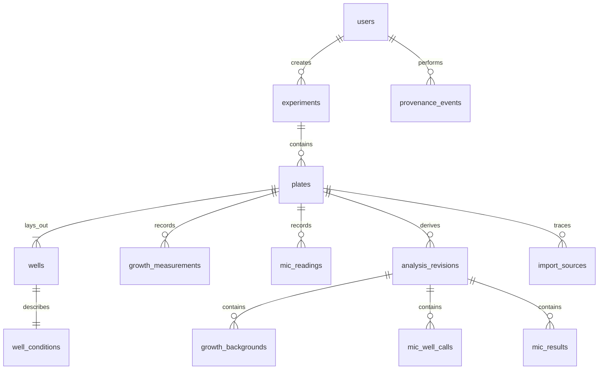

# Schema guide

The authoritative column, constraint, lifecycle, and index specification is
`docs/contracts/SCHEMA_V1.md`; executable DDL is in ordered `migrations/`.

Stable UUID-like text IDs—not names or filenames—identify users, experiments,
plates, wells, revisions, imports, results, and events. A well's physical identity
is unique within a plate. Growth time identity uses both sequential `time_index`
and integer elapsed microseconds; floating minutes are presentation values only.

Raw growth and MIC tables have update/delete prevention triggers. Derived data is
keyed by immutable revisions, with one current revision per plate/algorithm.
Metadata and layout update only their own tables under optimistic concurrency.
Soft deletion records actor and time while retaining every relationship.

Indexes support plate library filters, well loading, growth measurement order,
MIC result search, current revisions, import idempotency, and provenance history.
Use `EXPLAIN QUERY PLAN` before adding an index; in Turso, adding an index also
consumes reads/writes for existing rows.

Migrations are append-only and checksum-verified. Never modify an applied SQL
file. Schema changes require an ADR, forward migration, backup/restore test,
repository contract test, and portable-format impact review.

Migration 0003 is a data-only compatibility migration: it registers custom layout
column names already stored in non-deleted well JSON before assay-wide column
definitions were introduced. It does not modify well JSON or raw measurements.
